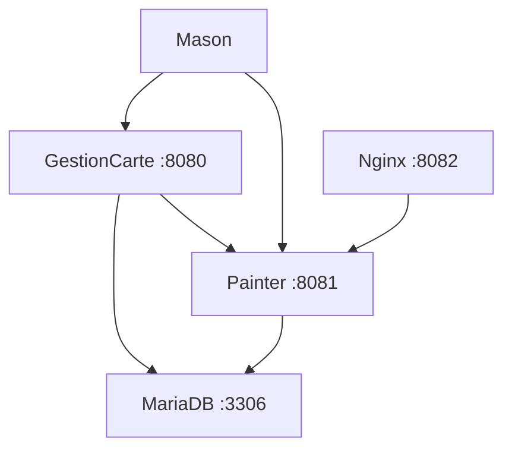

# 🎯 CardManager - Multi-Service Docker Architecture

> **Card management system with microservices architecture**

[](https://docker.com)
[](https://spring.io)
[](https://openjdk.org)

## 🏗️ Architecture



### Services
- **🖼️ GestionCarte** (`:8080`) - Main card management application
- **🎨 Painter** (`:8081`) - Image processing and management service
- **🔧 Mason** - Common library (utilities, JPA, cache)
- **🗄️ MariaDB** (`:3306`) - Relational database
- **⚡ Nginx** (`:8082`) - High-performance static image server

## 🚀 Quick Start

### 1️⃣ Initial Setup
```bash
# Clone the project
git clone <your-repository>
cd cardmanager

# Automatic Git configuration
chmod +x scripts/configure-git.sh
./scripts/configure-git.sh
```

### 2️⃣ Automatic Startup
```bash
# Build and complete startup
chmod +x build-quick-standalone.sh
./build-quick-standalone.sh
```

### 3️⃣ Access Services
- **📱 Main Application** : http://localhost:8080
- **🎨 Painter API** : http://localhost:8081
- **🖼️ Static Images** : http://localhost:8082
- **📊 Swagger UI** : http://localhost:8080/swagger-ui.html

## ⚙️ Configuration

### Environment Variables (.env)
```bash
# Git Repositories
MASON_REPO_URL=https://github.com/ialame/mason
PAINTER_REPO_URL=https://github.com/ialame/painter
GESTIONCARTE_REPO_URL=https://github.com/ialame/gestioncarte

# Branches (optional)
MASON_BRANCH=main
PAINTER_BRANCH=main
GESTIONCARTE_BRANCH=main

# Git Token (for private repositories)
GIT_TOKEN=your_github_token_here
```

### Database
```yaml
# Development (Integrated MariaDB)
SPRING_DATASOURCE_URL: jdbc:mariadb://mariadb:3306/dev
SPRING_DATASOURCE_USERNAME: ia
SPRING_DATASOURCE_PASSWORD: foufafou

# Production (External Database)
SPRING_DATASOURCE_URL: jdbc:mariadb://your-db:3306/production
```

## 🛠️ Useful Commands

### Docker Compose
```bash
# Complete startup
docker-compose up -d

# Real-time logs
docker-compose logs -f

# Restart a service
docker-compose restart gestioncarte

# Complete shutdown
docker-compose down

# Complete cleanup
docker-compose down --volumes --remove-orphans
```

### Maintenance
```bash
# Data export
./export-data.sh

# Project cleanup
./scripts/cleanup-project.sh

# Complete rebuild
docker-compose build --no-cache
```

## 📁 Project Structure

```
cardmanager/
├── 📄 docker-compose.yml          # Main configuration
├── 📄 build-quick-standalone.sh   # Automatic build script
├── 📄 export-data.sh             # Data export
├── 📄 .env.template              # Configuration template
│
├── 🐳 docker/                    # Dockerfiles
│   ├── mason/Dockerfile
│   ├── painter/Dockerfile
│   └── gestioncarte/Dockerfile
│
├── ⚙️ config/                    # Configurations
│   ├── application-docker.properties
│   └── nginx.conf
│
├── 📜 scripts/                   # Utility scripts
│   ├── configure-git.sh
│   └── cleanup-project.sh
│
└── 💾 volumes/                   # Persistent data
    ├── db_data/                  # MariaDB data
    └── images/                   # Painter images
```

## 🔍 Monitoring and Logs

### Health Checks
```bash
# Check service status
docker-compose ps

# Detailed health check
curl http://localhost:8080/actuator/health
curl http://localhost:8081/actuator/health
```

### Service Logs
```bash
# Main application
docker-compose logs -f gestioncarte

# Image service
docker-compose logs -f painter

# Database
docker-compose logs -f mariadb
```

## 🚀 Production Deployment

### 1. Secure Configuration
```bash
# Copy and adapt configuration
cp .env.template .env.production

# Modify sensitive values
nano .env.production
```

### 2. External Database
```yaml
# In docker-compose.override.yml
services:
  gestioncarte:
    environment:
      - SPRING_DATASOURCE_URL=jdbc:mariadb://prod-db:3306/cardmanager
      - SPRING_DATASOURCE_USERNAME=${DB_USER}
      - SPRING_DATASOURCE_PASSWORD=${DB_PASSWORD}
```

### 3. Production Volumes
```yaml
volumes:
  cardmanager_images:
    driver: local
    driver_opts:
      type: nfs
      o: addr=your-nfs-server,rw
      device: ":/path/to/images"
```

## 🐛 Troubleshooting

### Common Issues

#### ❌ Services not starting
```bash
# Check dependencies
docker-compose ps

# Rebuild images
docker-compose build --no-cache

# Check configuration
docker-compose config
```

#### ❌ Database connection errors
```bash
# Test connection
docker-compose exec mariadb mysql -u ia -p

# Check logs
docker-compose logs mariadb
```

#### ❌ Git build issues
```bash
# Check credentials
docker-compose logs builder

# Test Git access
git ls-remote $MASON_REPO_URL
```

### Support
- 📖 **Complete Documentation** : `docs/`
- 🐛 **Issues** : Create a GitHub issue
- 💬 **Questions** : Contact technical team

## 📈 Performance

### Included Optimizations
- ✅ **Nginx Cache** (30 days for images)
- ✅ **HikariCP Connection Pool** optimized
- ✅ **Gzip Compression** enabled
- ✅ **CORS Headers** configured
- ✅ **Intelligent Health Checks**
- ✅ **SSD Volumes** recommended

### Metrics
- **Startup Time** : ~2-3 minutes
- **Required Memory** : 4GB RAM minimum
- **Storage** : 10GB for data + images

---

**🎯 CardManager - Production Ready!**
