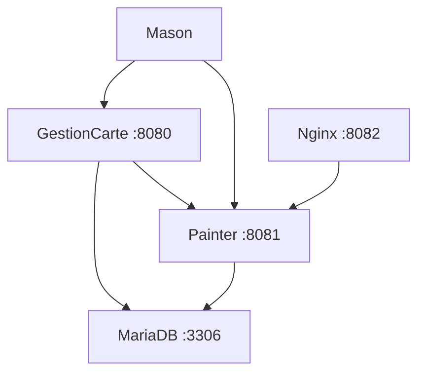

# 🎯 CardManager - Architecture Docker Multi-Services

> **Système de gestion de cartes avec architecture microservices**

[](https://docker.com)
[](https://spring.io)
[](https://openjdk.org)

## 🏗️ Architecture



### Services
- **🖼️ GestionCarte** (`:8080`) - Application principale de gestion des cartes
- **🎨 Painter** (`:8081`) - Service de traitement et gestion d'images
- **🔧 Mason** - Bibliothèque commune (utilities, JPA, cache)
- **🗄️ MariaDB** (`:3306`) - Base de données relationnelle
- **⚡ Nginx** (`:8082`) - Serveur d'images statiques haute performance

## 🚀 Démarrage Rapide

### 1️⃣ Configuration initiale
```bash
# Cloner le projet
git clone <votre-repository>
cd cardmanager

# Configuration Git automatique
chmod +x scripts/configure-git.sh
./scripts/configure-git.sh
```

### 2️⃣ Démarrage automatique
```bash
# Build et démarrage complet
chmod +x build-quick-standalone.sh
./build-quick-standalone.sh
```

### 3️⃣ Accès aux services
- **📱 Application principale** : http://localhost:8080
- **🎨 API Painter** : http://localhost:8081
- **🖼️ Images statiques** : http://localhost:8082
- **📊 Swagger UI** : http://localhost:8080/swagger-ui.html

## ⚙️ Configuration

### Variables d'environnement (.env)
```bash
# Repositories Git
MASON_REPO_URL=https://github.com/ialame/mason
PAINTER_REPO_URL=https://github.com/ialame/painter
GESTIONCARTE_REPO_URL=https://github.com/ialame/gestioncarte

# Branches (optionnel)
MASON_BRANCH=main
PAINTER_BRANCH=main
GESTIONCARTE_BRANCH=main

# Token Git (pour dépôts privés)
GIT_TOKEN=your_github_token_here
```

### Base de données
```yaml
# Développement (MariaDB intégrée)
SPRING_DATASOURCE_URL: jdbc:mariadb://mariadb:3306/dev
SPRING_DATASOURCE_USERNAME: ia
SPRING_DATASOURCE_PASSWORD: foufafou

# Production (Base externe)
SPRING_DATASOURCE_URL: jdbc:mariadb://your-db:3306/production
```

## 🛠️ Commandes Utiles

### Docker Compose
```bash
# Démarrage complet
docker-compose up -d

# Logs en temps réel
docker-compose logs -f

# Redémarrage d'un service
docker-compose restart gestioncarte

# Arrêt complet
docker-compose down

# Nettoyage complet
docker-compose down --volumes --remove-orphans
```

### Maintenance
```bash
# Export des données
./export-data.sh

# Nettoyage du projet
./scripts/cleanup-project.sh

# Reconstruction complète
docker-compose build --no-cache
```

## 📁 Structure du Projet

```
cardmanager/
├── 📄 docker-compose.yml          # Configuration principale
├── 📄 build-quick-standalone.sh   # Script de build automatique
├── 📄 export-data.sh             # Export des données
├── 📄 .env.template              # Template de configuration
│
├── 🐳 docker/                    # Dockerfiles
│   ├── mason/Dockerfile
│   ├── painter/Dockerfile
│   └── gestioncarte/Dockerfile
│
├── ⚙️ config/                    # Configurations
│   ├── application-docker.properties
│   └── nginx.conf
│
├── 📜 scripts/                   # Scripts utilitaires
│   ├── configure-git.sh
│   └── cleanup-project.sh
│
└── 💾 volumes/                   # Données persistantes
    ├── db_data/                  # Données MariaDB
    └── images/                   # Images Painter
```

## 🔍 Surveillance et Logs

### Health Checks
```bash
# Vérifier l'état des services
docker-compose ps

# Health check détaillé
curl http://localhost:8080/actuator/health
curl http://localhost:8081/actuator/health
```

### Logs par service
```bash
# Application principale
docker-compose logs -f gestioncarte

# Service d'images
docker-compose logs -f painter

# Base de données
docker-compose logs -f mariadb
```

## 🚀 Déploiement en Production

### 1. Configuration sécurisée
```bash
# Copier et adapter la configuration
cp .env.template .env.production

# Modifier les valeurs sensibles
nano .env.production
```

### 2. Base de données externe
```yaml
# Dans docker-compose.override.yml
services:
  gestioncarte:
    environment:
      - SPRING_DATASOURCE_URL=jdbc:mariadb://prod-db:3306/cardmanager
      - SPRING_DATASOURCE_USERNAME=${DB_USER}
      - SPRING_DATASOURCE_PASSWORD=${DB_PASSWORD}
```

### 3. Volumes de production
```yaml
volumes:
  cardmanager_images:
    driver: local
    driver_opts:
      type: nfs
      o: addr=your-nfs-server,rw
      device: ":/path/to/images"
```

## 🐛 Dépannage

### Problèmes courants

#### ❌ Services qui ne démarrent pas
```bash
# Vérifier les dépendances
docker-compose ps

# Reconstruire les images
docker-compose build --no-cache

# Vérifier la configuration
docker-compose config
```

#### ❌ Erreurs de connexion base de données
```bash
# Tester la connexion
docker-compose exec mariadb mysql -u ia -p

# Vérifier les logs
docker-compose logs mariadb
```

#### ❌ Problèmes de build Git
```bash
# Vérifier les credentials
docker-compose logs builder

# Tester l'accès Git
git ls-remote $MASON_REPO_URL
```

### Support
- 📖 **Documentation complète** : `docs/`
- 🐛 **Issues** : Créer une issue GitHub
- 💬 **Questions** : Contacter l'équipe technique

## 📈 Performance

### Optimisations incluses
- ✅ **Cache Nginx** (30 jours pour les images)
- ✅ **Pool de connexions** HikariCP optimisé
- ✅ **Compression Gzip** activée
- ✅ **Headers CORS** configurés
- ✅ **Health checks** intelligents
- ✅ **Volumes SSD** recommandés

### Métriques
- **Temps de démarrage** : ~2-3 minutes
- **Mémoire requise** : 4GB RAM minimum
- **Stockage** : 10GB pour les données + images

---

**🎯 CardManager - Prêt pour la production !**
